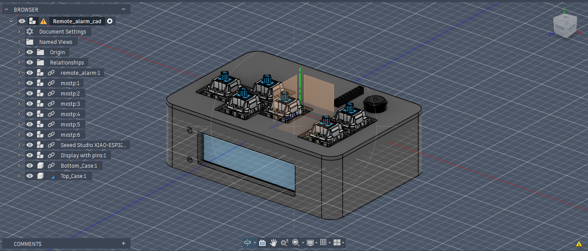
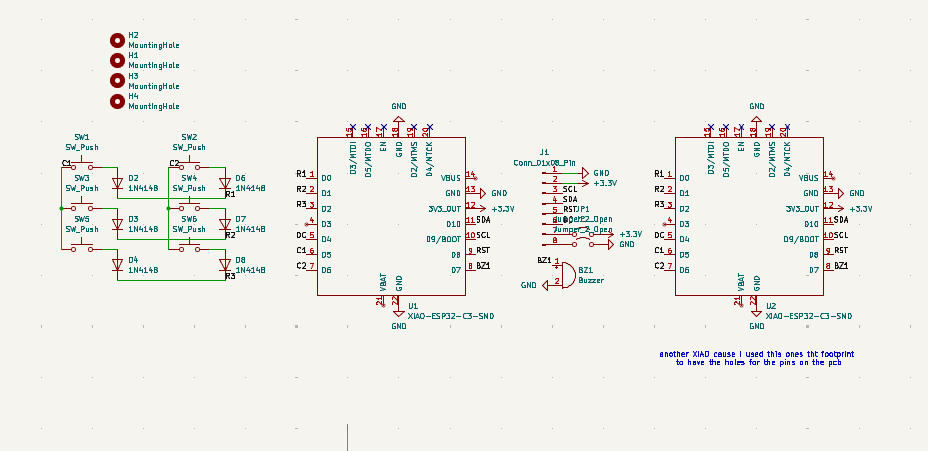
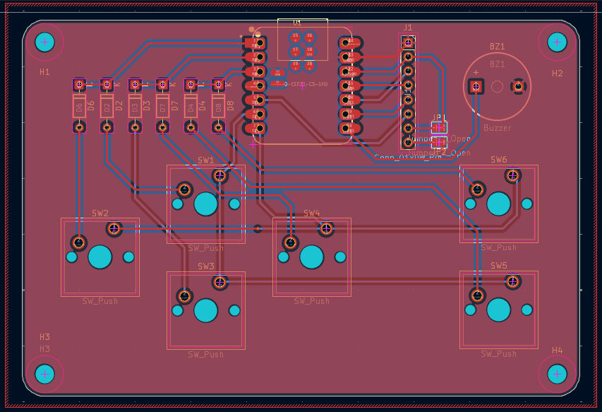
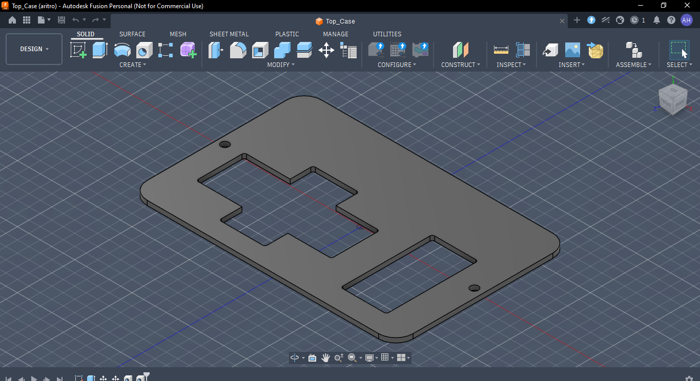
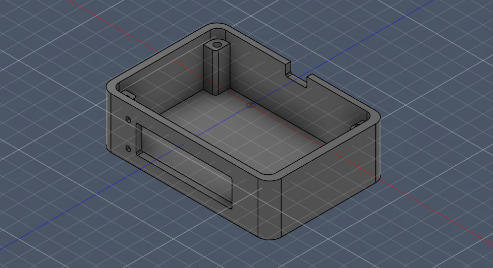

# Remote Alarm 
remote alarm is an alarm clock that is also a multipurpose controller! it can be used to play games, control rc vehicles, can act as a console!

# Screenshots!
## CAD

## Schematic

## PCB

## Case top and bottom

## Firmware
I used the example code for the display and copied section of the clock code from another repo : https://github.com/word9317/hopOffBro/tree/main/Firmware 
and cleaned it up to use for my clock.

## BOM

| Component | Quantity |
|-----------|----------|
| Seeed Studio esp 32c3 | 1x |
| MX-Style Switch | 6x |
| 1N4148 Diode | 6x |
| Blank DSA keycaps | 6x | 
| 2.25Inch TFT Display | 1x | 
| 2.54mm 8 Pin Male Header | 1x | 
| 3.3V piezo Buzzer | 1x |
| M3x8mm Screws | 4x |
| M3x16mm Screws | 4x |
| M3x5mx4mm heatset inserts  |8x | 
| Custom PCB | 1x |
| 3D printed case | 1x |

